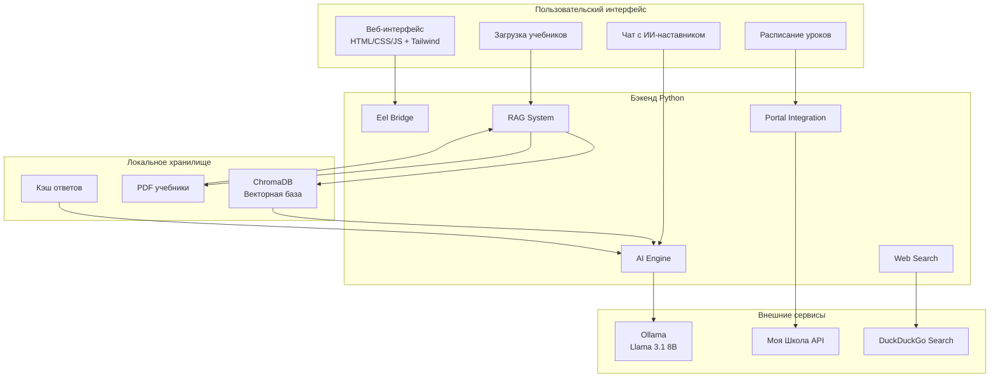

# 🏗️ Архитектура AI-Tutor

## 🎯 Концепция

AI-Tutor - это интеллектуальная экосистема, которая объединяет локальную языковую модель с персональными учебными данными школьника, создавая адаптированную систему обучения.

### Философия дизайна
- **Конфиденциальность:** Все данные обрабатываются локально
- **Педагогический подход:** Объяснение вместо решения
- **Адаптивность:** Персонализация под учебную программу ученика
- **Интеграция:** Бесшовная работа с школьным порталом

---

## 🔄 Архитектурная диаграмма



---

## 🧩 Компоненты системы

### 1. Фронтенд (Eel + Web)
**Технологии:** HTML5, CSS3, JavaScript, TailwindCSS
- **Eel Bridge:** Связь между Python и JavaScript
- **Адаптивный интерфейс:** Работает на всех платформах
- **Real-time обновления:** Мгновенная реакция на действия пользователя

### 2. Бэкенд (Python)
**Основные модули:**

#### 🎓 Portal Integration
- **BrowserConnector:** Автоматизация браузера для авторизации
- **MosregParser:** Парсинг данных школьного портала
- **Token Management:** Безопасное хранение токенов доступа

#### 🤖 AI Engine
- **Ollama Integration:** Локальное выполнение моделей
- **Prompt Engineering:** Система промптов для педагогического подхода
- **Response Streaming:** Пошаговая генерация ответов

#### 🔍 RAG System
- **ChromaDB:** Векторное хранилище знаний
- **Embeddings:** all-MiniLM-L6-v2 для семантического поиска
- **Context Management:** Умное извлечение релевантной информации

#### 🌐 Web Search
- **DuckDuckGo API:** Безопасный поиск без API ключей
- **Source Validation:** Проверка достоверности источников
- **Result Filtering:** Образовательная фильтрация

---

## 💾 Потоки данных

### 1. Синхронизация с порталом
```
1. Авторизация по токену
2. Получение расписания уроков
3. Загрузка домашних заданий
4. Кэширование данных локально
```

### 2. Обработка запроса ученика
```
1. Анализ вопроса и предмета
2. Поиск в векторной базе учебников
3. Веб-поиск дополнительной информации
4. Формирование контекста для ИИ
5. Генерация педагогического ответа
```

### 3. RAG Pipeline
```
PDF учебники → Chunking → Embeddings → ChromaDB
                                    ↓
                              Семантический поиск → Релевантные фрагменты → Контекст ИИ
```

---

## 🛡️ Безопасность и конфиденциальность

### Локальная обработка
- **Данные не покидают устройство:** Вся обработка происходит локально
- **Шифрование:** Локальное хранение чувствительных данных
- **Нет отслеживания:** Отсутствие телеметрии и сбора статистики

### Защита от ошибок
- **Fallback механизмы:** Резервные источники данных
- **Валидация ответов:** Проверка корректности генерации
- **Graceful degradation:** Работа при недоступности компонентов

---

## ⚡ Оптимизация производительности

### Модели
- **Квантование:** 4-bit quantization для снижения требований к памяти
- **Легкие архитектуры:** Использование оптимизированных моделей
- **Кэширование:** Умное кэширование ответов и эмбеддингов

### Алгоритмы
- **Параллельная обработка:** Асинхронное выполнение запросов
- **Lazy loading:** Загрузка компонентов по требованию
- **Потоковая генерация:** Мгновенное отображение ответов

---

## 🔧 Технические спецификации

### Минимальные требования
- **CPU:** 4+ ядер (рекомендуется 8+)
- **RAM:** 8 ГБ (минимум 4 ГБ для легких моделей)
- **Storage:** 10 ГБ (модели + база знаний)
- **OS:** Windows 10+, macOS 10.15+, Ubuntu 20.04+

### Рекомендуемые требования
- **CPU:** 8+ ядер с поддержкой AVX
- **RAM:** 16 ГБ+ для комфортной работы
- **GPU:** Опционально для ускорения (NVIDIA CUDA)
- **Storage:** 20 ГБ+ SSD для быстрой загрузки

---

## 🚀 Масштабируемость

### Горизонтальное масштабирование
- **Многопользовательский режим:** Поддержка нескольких профилей
- **Распределенная RAG:** Возможность federation баз знаний
- **Кластеризация:** Объединение нескольких экземпляров

### Вертикальное масштабирование
- **Модульная архитектура:** Легкое добавление новых функций
- **Plugin система:** Расширение возможностей через плагины
- **API интеграции:** Подключение внешних сервисов

---

## 🔄 Жизненный цикл разработки

### 1. Разработка
- **Feature Branches:** Изолированная разработка функций
- **Code Review:** Обязательная проверка кода
- **Testing:** Автоматические и ручные тесты

### 2. Деплоймент
- **Local First:** Приоритет локального запуска
- **Cross-platform:** Сборка под разные ОС
- **Updates:** Автоматическое обновление компонентов

### 3. Мониторинг
- **Logging:** Детальное логирование всех процессов
- **Metrics:** Сбор метрик производительности
- **Feedback:** Система обратной связи

---

## 🎨 Дизайн-принципы

### UI/UX
- **Минимализм:** Фокус на контенте, а не на интерфейсе
- **Доступность:** Поддержка разных уровней навыков
- **Адаптивность:** Работа на различных устройствах

### Педагогический дизайн
- **Конструктивизм:** Помощь в построении знаний
- **Сократовский метод:** Наводящие вопросы вместо ответов
- **Персонализация:** Адаптация под стиль обучения

---

## 🔮 Будущее развитие

### Краткосрочные цели (3-6 месяцев)
- [ ] Мобильное приложение
- [ ] Голосовой ввод/вывод
- [ ] Расширенная аналитика прогресса

### Среднесрочные цели (6-12 месяцев)
- [ ] Мультимодальность (изображения, аудио)
- [ ] Коллаборативные функции
- [ ] Интеграция с образовательными платформами

### Долгосрочные цели (1+ год)
- [ ] Нейросеть адаптивного обучения
- [ ] AR/VR возможности
- [ ] Распределенная система знаний

---

**Архитектура AI-Tutor спроектирована для масштабирования, надежности и педагогической эффективности.**
